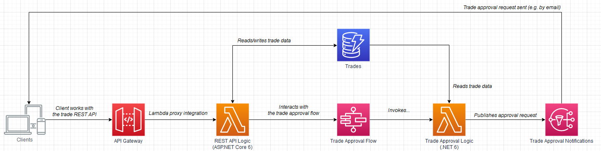

## Lab: Git Branches

There are two branches:

- The `challenge` branch contain a few bugs/challenges that you need to solve as part of the tasks in this lab.
- The `solution` branch contain solutions to all tasks in this lab and can be used as reference in case you get stuck.

📖 Remember, doing this lab is all about learning. Solving problems is often a good mechanism to reinforce learning and it is therefore highly recommended that you use the `challenge` branch for this lab. Please take your time to dive deep and to learn and be curious.

## Lab: Serverless Trading
In this lab we're going to build a Serverless Trading Service utilizing AWS services such as:

- Amazon API Gateway
- Amazon DynamoDB
- AWS Step Functions
- AWS Lambda

The Serverless Trading Service will support simple trade management and manual trade approval. The service is built on an event-driven architecture powered by Serverless services and .NET 6 running on AWS.

The architecture will end up looking like this:



We will start our work from a skeleton where the main framework pieces are already configured, however, nothing is deployed and some central programming logic is missing in multiple places. Through the lab you will learn how to deploy the infrastructure of the Serverless Trading Service using the AWS CDK. Furthermore, to get the missing programming logic in place, you will also get to program AWS Lambda functions and call AWS services using the AWS SDK for .NET.

Summarized, on this journey, we're going to explore:

- How to create Infrastructure as Code (IaC) with the AWS CDK
- How to work with AWS services via the AWS SDKs
- How to work with .NET 6 and ASP.NET Core 6 in AWS Lambda
- .. and much more!

Make sure you have your coffee ready (or any other refreshments) - this is going to be AWSome - let's do this! 🚀🙌

## Pre-requisites

- Latest AWS CDK
- .NET 6 SDK
- Amazon.Lambda.Tools .NET CLI extension
- PowerShell 7

## Installing Pre-requisites in an AWS Cloud9 Environment

If you are doing this lab in an AWS Cloud9 environment, please follow the below setup instructions.

**Extending the Cloud9 environment volume**

When you launch a Cloud9 environment it comes with a 10GB disk space. Out of the box, the environment contains a range of tools, and because we need to install a few more, we would need a bit more disk space.

To resize the disk from 10GB to 20GB you need to invoke the `resize-cloud9-volume.sh` located in the `Tools` folder (in the lab source). The script is documented [here](https://docs.aws.amazon.com/cloud9/latest/user-guide/move-environment.html#move-environment-resize).

Here follows an example of how to invoke the script to extend the Cloud9 volume to 20GB:

```
./Tools/resize-cloud9-volume.sh 20
```

**Installing the latest CDK**

CDK is already installed on the Cloud9 environment, however, we want to ensure that we are running the lab using the latest stable version. To do so, we use `npm` to update the `cdk` package:

```
npm install -g cdk
```

**Run CDK Bootstrap**

Before we can start using the AWS CDK, we need to bootstrap it. To do so, simply invoke:

```
cdk bootstrap
```

**Installing .NET 6 SDK**

Instructions are based on: [.NET Core sample for AWS Cloud9](https://docs.aws.amazon.com/cloud9/latest/user-guide/sample-dotnetcore.html#sample-dotnetcore-setup).

```
# Go to home dir
cd ~

# Update packages
sudo yum -y update

# Get the .NET install script and set executable permissions on it
wget https://dot.net/v1/dotnet-install.sh
sudo chmod u=rx dotnet-install.sh

# Run the .NET install script
./dotnet-install.sh -c Current

# Update the PATH with the new binaries
echo 'export PATH="$PATH:$HOME/.local/bin:$HOME/bin:$HOME/.dotnet"' >> ~/.bashrc
. ~/.bashrc

# Print the installed .NET version
dotnet --version

# Remove the .NET install script
sudo rm dotnet-install.sh
```

**Installing Amazon.Lambda.Tools .NET CLI extension**

Instructions are based on: [.NET Core sample for AWS Cloud9](https://docs.aws.amazon.com/cloud9/latest/user-guide/sample-dotnetcore.html#sample-dotnetcore-lambda).

```
# Go to home dir
cd ~

# Using the .NET CLI: install the 'Amazon.Lambda.Tools' extension
dotnet tool install -g Amazon.Lambda.Tools

# Update the PATH with the new binaries
echo 'export PATH="$PATH:$HOME/.local/bin:$HOME/bin:$HOME/.dotnet:$HOME/.dotnet/tools"' >> ~/.bashrc
echo 'export DOTNET_ROOT="$HOME/.dotnet"' >> ~/.bashrc
. ~/.bashrc

# Verify the extension is installed
dotnet lambda
```

**Installing PowerShell 7**

Instructions are based on: [Installing PowerShell on Red Hat Enterprise Linux (RHEL)](https://docs.microsoft.com/en-us/powershell/scripting/install/install-rhel?view=powershell-7.2#installation-via-package-repository).

```
# Register the Microsoft RedHat repository
curl https://packages.microsoft.com/config/rhel/7/prod.repo | sudo tee /etc/yum.repos.d/microsoft.repo

# Install PowerShell
sudo yum install -y powershell

# Verify PowerShell is installed
pwsh --version
```

**Starting PowerShell 7**

We will be using PowerShell as our terminal during this lab, so please start it using:

```
$ pwsh
PowerShell 7.2.3
Copyright (c) Microsoft Corporation.

https://aka.ms/powershell
Type 'help' to get help.
PS >
```

### Lab 1 - The Lab Project Structure
If we list the files in the directory where the current README file is located, we should get a listing similar to this:

```
> ls
ServerlessTrading.Api
ServerlessTrading.Entities
ServerlessTrading.Functions
ServerlessTrading.Infra
ServerlessTrading.Lib
README.md
ServerlessTrading.sln
...
```

This will be the *"root"* of our project and our working directory throughout this lab. We will refer to this *"root"* directory as `./` throughout the lab instructions.

### Lab 2 - Compile and Package the Serverless Trading REST API Lambda Function
First, let's make sure we can compile and package our REST API located in `./ServerlessTrading.Api`. The REST API is based on ASP.NET Core 6 which we can run in AWS Lambda. You can read more about .NET 6 support in AWS Lambda [here](https://aws.amazon.com/blogs/compute/introducing-the-net-6-runtime-for-aws-lambda/).

If we go into the `./ServerlessTrading.Api` directory and list the content, we see:
```
> cd ./ServerlessTrading.Api
> ls
src
Deploy.ps1
Package.ps1
```

A short description of each entry:
- The `src` folder contains the source code of our REST API (the ASP.NET Core 6 project).
- The `Deploy.ps1` is a helper script that allow us to deploy our Lambda function in a few seconds (we will use that for updating the Lambda function when it has been deployed by the CDK).
- The `Package.ps1` is a helper script that *restores dependencies*, *compiles the project* and *packages* it up for use with AWS Lambda.

Let's ensure we can compile and package the REST API by running:

```
> cd ./ServerlessTrading.Api
> ./Package.ps1
Amazon Lambda Tools for .NET Core applications (5.3.0)
Project Home: https://github.com/aws/aws-extensions-for-dotnet-cli, https://github.com/aws/aws-lambda-dotnet
...
... zipping: ServerlessTrading.Api
... zipping: ServerlessTrading.Api.deps.json
... zipping: ServerlessTrading.Api.dll
... zipping: ServerlessTrading.Api.pdb
...
Created publish archive (...\serverless-trading\ServerlessTrading.Api\src\bin\lambda-package.zip).
Lambda project successfully packaged: ...\serverless-trading\ServerlessTrading.Api\src\bin\lambda-package.zip
```

If you see `Lambda project successfully packaged` we're good to go. Don't worry, we will get back to the engine room of the REST API in a later lab.

### Lab 3 - Compile and Package the Serverless Trading Utility Lambda Functions
Besides the Lambda-powered REST API, we also have a set of other utility Lambda Functions that power our Serverless Trading platform. These are located in `./ServerlessTrading.Functions`.

As in the previous lab, we will get back to the internals of this project in a later lab. For now, we just want to ensure we can compile and package the skeleton. Let's do the same as above:

```
> cd ./ServerlessTrading.Functions
> ./Package.ps1
```

If you get a successful output, we're good to go.

### Lab 4 - Working with Infrastructure as Code using AWS CDK
At this stage, we have now compiled and packaged our artifacts, and we're now ready to get start deploying resources to the AWS Cloud.

In this lab, we will provision resources based on infrastructure as code (IaC) using the AWS Cloud Development Kit (CDK) to generate declarative CloudFormation templates. Based on these templates, we use the AWS CloudFormation service to provision resources for us.

Basically, our infrastructure is declared and managed using a development workflow similar to this:

`CDK Stack -> CloudFormation Template -> Cloud Resources`

Let's try and list the contents of the directory: `./ServerlessTrading.Infra/src/Stacks`:

```
> ls ./ServerlessTrading.Infra/src/Stacks
FunctionsStack.cs
NotificationsStack.cs
RestApiStack.cs
StorageStack.cs
WorkflowStack.cs
```

This shows us the stacks we're going to use for getting our infrastructure declared and provisioned.

If do a `cat ls ./ServerlessTrading.Infra/src/Program.cs` we get:

```
using Amazon.CDK;
using ServerlessTrading.Infra.Stacks;

namespace ServerlessTrading.Infra
{
    internal sealed class Program
    {
        public static void Main()
        {
            var app = new App();
            _ = new StorageStack(app, "storage", new StackProps
            {
                StackName = "serverless-trading-storage-stack"
            });
            _ = new NotificationsStack(app, "notifications", new StackProps
            {
                StackName = "serverless-trading-notifications-stack"
            });
            _ = new FunctionsStack(app, "functions", new StackProps
            {
                StackName = "serverless-trading-functions-stack"
            });
            _ = new RestApiStack(app, "rest-api", new StackProps
            {
                StackName = "serverless-trading-rest-api-stack"
            });
            _ = new WorkflowStack(app, "workflow", new StackProps
            {
                StackName = "serverless-trading-workflow-stack"
            });
            app.Synth();
        }
    }
}
```

When we run the CDK commands in the following labs, this is the main entry point where the CDK will be looking for stacks. As we see here, we have the different stacks declared. Each stack has a "logical" (shorter) name, and a (longer) stack name (the name of the resulting CloudFormation stack). When using the `cdk` cli, we will use the logical name to refer to the individual stacks.

In the following, we will start deploying resources.

❗ Before we progress, make sure you have completed both lab 2 and lab 3, and packaged both the Serverless Trading REST API and the Serverless Trading utility functions.

### Lab 5 - Deploy Storage Stack

The first stack is ready to go and doesn't need any modification. So let's get this stack deployed and get our first win!

```
> cd ./ServerlessTrading.Infra
> cdk deploy storage
```

Assuming that went well, let's have a look at what just happened.

Let's start by going to the [CloudFormation Service](https://console.aws.amazon.com/cloudformation/home) in the AWS Management Console and find the CloudFormation stack. Look for a menu item called `Stacks`.

On the list of stacks, you should now see the stack: `serverless-trading-storage-stack`

If we select the stack and click the *Resources* tab, we now see a list of the resources deployed by the stack. One of the resources is of type `AWS::DynamoDB::Table` - try and click the link in the *Physical ID* column and explore the newly created table.

### Lab 6 - Deploy Notifications Stack

We have now got our first CDK stack deployed - good work! Next up, we would like to get our notifications stack deployed. This stack should deploy an SNS topic we can use for notifications. In particular, when we send a trade for manual approval, we would like that any subscriber to the SNS topic, can either approve or reject the trade.

Using the `cdk` cli command again, let's deploy the `notifications` stack:

```
> cd ./ServerlessTrading.Infra
> cdk deploy notifications
```

When done, a new SNS topic with name `serverless-trading-notification-topic` should be deployed and visible in the [SNS Service](https://console.aws.amazon.com/sns/v3/home).

Now, let's assume that *you* are in charge of manual trade approval and all approval requests therefore should be sent to your email address. For this to happen, we will need to create a subscription on the SNS topic.

To setup an email subscription via the Management Console, go to the [SNS Service](https://console.aws.amazon.com/sns/v3/home) and select the topic `serverless-trading-notification-topic`.

From here, select *Create subscription* > Protocol: *email* > type in *your email address* > Press: *Create subscription*. You should now get a message saying:

> Subscription to serverless-trading-notification-topic created successfully.

Wait a minute or two and check your inbox for a verification email from *AWS Notifications <no-reply@sns.amazonaws.com>* with subject: *AWS Notification - Subscription Confirmation*:

> You have chosen to subscribe to the topic:
>
> arn:aws:sns:\<region>:\<accountId>:serverless-trading-notification-topic
>
> To confirm this subscription, click or visit the link below (If this was in error no action is necessary): 
>
> Confirm subscription

Make sure to press the *Confirm subscription* link. Doing so, should open a browser and give you a message similar to:

> Subscription confirmed!
>
> You have successfully subscribed.
> 
> Your subscription's id is:
> 
> arn:aws:sns:\<region>:\<accountId>:serverless-trading-notification-topic:\<guid>

At this point, you're now subscribing to messages sent to the topic.

### Lab 7 - SSM Parameters
At this point, you might have noticed that the stacks we have deployed this far, contains a `StringParameter` resource. This resource is a Simple Systems Manager (SSM) Parameter, that we use to store config of our Serverless Trading service.

**[Task]**
In this task, you should go to the [SSM service](https://console.aws.amazon.com/systems-manager/parameters/) and explore the parameters that has been created so far. We expect the following parameters to be present:

```
/serverless-trading/config/notification-topic-arn
/serverless-trading/config/notification-topic-name
/serverless-trading/config/trades-table-arn
/serverless-trading/config/trades-table-name
```

The parameters are read in some of the following CDK stacks and used to configure the environment variables of our Lambda functions.

### Lab 8 - Deploy the Serverless Trading REST API Lambda Function
Next, we're going to deploy the REST API powering our Serverless Trading service which we have already compiled and packaged. Before we deploy the CDK stack, let's have a look at the CDK constructs declared in it (see `./ServerlessTrading.Infra/src/Stacks/RestApiStack.cs`):
```
var restApiProxyFunction = new Function(this, "restApiProxyFunction", new FunctionProps
{
    Architecture = Architecture.ARM_64,
    Runtime = Runtime.DOTNET_6,
    FunctionName = "serverless-trading-rest-api-proxy",
    Description = "Serverless Trading - REST API",
    Handler = "ServerlessTrading.Api",
    Code = Code.FromAsset(@"..\ServerlessTrading.Api\src\bin\lambda-package.zip"),
    MemorySize = 2048,
    Timeout = Duration.Seconds(29),
    Environment = new Dictionary<string, string>
    {
        ["ASPNETCORE_ENVIRONMENT"] = "Production",
        ["ServerlessTrading__Config__TradesTableName"] = tradesTableName
    },
    InitialPolicy = ...
}

var restApi = new LambdaRestApi(this, "restApi", new LambdaRestApiProps
{
    RestApiName = "ServerlessTradingRestApi",
    Handler = restApiProxyFunction,
    Proxy = true,
    EndpointTypes = new[] { EndpointType.REGIONAL }
});
```

From this, we see that we use two high level CDK constructs: `Function` and `LambdaRestApi`. The `Function` is where our REST API logic is running. The `LambdaRestApi` creates an API Gateway resource in front of our Lambda functions, and configures API Gateway with a *Lambda proxy integration* that forwards all HTTP requests to our REST API running in AWS Lambda.

Let's have a closer look at the `Function` CDK construct:

**Architecture** We run on 64-bit ARM-based processors powered by AWS Graviton2. This enables us to benefit from the better price performance of the AWS Graviton2 processors compared to their x86 based equivalents. You can read more about AWS Lambda and AWS Graviton2 [here](https://aws.amazon.com/blogs/compute/migrating-aws-lambda-functions-to-arm-based-aws-graviton2-processors/).

**Runtime** Our Lambda function contains an ASP.NET Core 6 API, and we therefore target the managed .NET 6 runtime.

**FunctionName** This is the name of our Lambda function.

**Description** This is the description of our Lambda function.

**Handler** Here, we tell the Lambda runtime how to start our Lambda function. As we will see in a later lab, we use top-level statements in our ASP.NET Core 6 project. To run the project, we will therefore have to tell AWS Lambda which executable to run, which is: `ServerlessTrading.Api` in our project. More on this [here](https://aws.amazon.com/blogs/compute/introducing-the-net-6-runtime-for-aws-lambda/).

**Code** Here we point to the artifact we build when we packaged the project. This is the zip archive containing the binaries of our REST API.

**MemorySize** The amount of memory (and thereby vCPU) allocated to the Lambda function.

**Timeout** This is the maximum amount of time the Lambda function will be allowed to run to handle a given request. As of this writing, a Lambda function is allowed to run for 900 seconds (15 minutes) [docs](https://docs.aws.amazon.com/lambda/latest/dg/gettingstarted-limits.html). However, because we front our Lambda function with API Gateway REST API, there is an integration timeout of 29 seconds [docs](https://docs.aws.amazon.com/apigateway/latest/developerguide/limits.html). So, even though a Lambda function as such can run for 900 seconds, it won't benefit us here, as API Gateway will timeout after 29 seconds and return an error to the caller.

**Environment** This specifies the environment variables for our Lambda function in a simple key-value dictionary. These can be read in our Lambda function and integrates well with the [environment variable configuration provider](https://docs.microsoft.com/en-us/dotnet/core/extensions/configuration-providers#environment-variable-configuration-provider) in .NET.

**InitialPolicy** Here we specify an inline IAM policy for our Lambda function. The content of this has been omitted for brevity. Following the best-practice of least-privilege, we only grant our Lambda function permission to work with the resources it needs to.

Next up, let's have a closer look at the `LambdaRestApi` CDK construct:

With this simple construct we configure a REST API in API Gateway with a Lambda Proxy integration. The proxy integration is enabled by setting `Proxy = true`. This essentially means, that we will get an API endpoint where all HTTP methods will be forwarded to the `Handler` Lambda function to process. In our case, the `Handler` is our ASP.NET Core 6 API which will be able to respond to the proxy integration request.

In this lab, we're are running with an endpoint of type: `EndpointType.REGIONAL` which basically means that we have a regional endpoint for our API which can be accessed over the Internet.

Right, that was a lot of insights - let's get the REST API deployed!

```
> cd ./ServerlessTrading.Infra
> cdk deploy rest-api
```

If all go well, we should now have a CloudFormation stack named `serverless-trading-rest-api-stack` in the list of stacks [here](https://console.aws.amazon.com/cloudformation/home) - please take a few minutes to have a look at the CloudFormation stack and inspect the different resources that have been created:

- A list of Lambda functions can be seen [here](https://console.aws.amazon.com/lambda/home).
- A list of API Gateway APIs can be found [here](https://console.aws.amazon.com/apigateway/main/apis).

To check that our REST API can be reached, we need to get the endpoint URL which API Gateway has generated for us. There are multi ways to find this:

- Look at the `Output` tab for the CloudFormation stack.
- Look at the SSM parameter `/serverless-trading/config/rest-api-base-url`.
- Select the API in the API Gateway service > go to `Stages` > select `prod` > and then you will find an `Invoke URL`.

With the base url at hand, we can try to invoke the health endpoint of our REST API:

```
> curl https://85ms7viqyj.execute-api.eu-west-1.amazonaws.com/prod/health
Hello from .NET 6.0.1 running on amzn.2-arm64.
```
If we get the *Hello...* message in return, we're good to go.

## Lab 9 - Deploy the Serverless Trading Lambda Functions
Next up, we need to deploy the remaining Lambda functions declared in `./ServerlessTrading.Infra/src/Stacks/FunctionsStack.cs`. These are:

- `serverless-trading-create-sample-trades` Lambda function that can help us generate sample trades and store them in our DynamoDB table.
- `serverless-trading-start-manual-trade-approval` Lambda function that can be invoked from a Step Function to facilitate the logic behind manual trade approval.

Comparing `./ServerlessTrading.Infra/src/Stacks/FunctionsStack.cs` with the REST API stack from our previous lab, there are a couple of differences in our use of the `Function` construct that we should note:

```
var createSampleTradesLambdaFunction = new Function(this, "createSampleTradesLambdaFunction", new FunctionProps
{
    Architecture = Architecture.ARM_64,
    Runtime = Runtime.DOTNET_6,
    FunctionName = "serverless-trading-create-sample-trades",
    Description = "Serverless Trading - Create Sample Trades",
    Handler = "ServerlessTrading.Functions::ServerlessTrading.Functions.Handler::CreateSampleTradesAsync",
    Code = Code.FromAsset(@"..\ServerlessTrading.Functions\src\bin\lambda-package.zip"),
    ...
```

Our code base is essentially a .NET 6 Class Library containing the logic for multiple Lambda functions. Because it is a class library, we're *not* using top-level statements and we will therefore have to specify a function handler string using the pattern: `<AssemblyName>::<TypeName>::<MethodName>` which instructs the managed .NET Lambda runtime where to find the method for a given Lambda function.

Let's get these two Lambda functions deployed:

```
> cd ./ServerlessTrading.Infra
> cdk deploy functions
```

Before we get hands on with these Lambda functions, let's continue to get the final infrastructure deployed - hang on - it is soon time to start coding!

## Lab 10 - Deploy the Serverless Trading Trade Approval Workflow
Finally, we're at the last CDK stack that needs to be deployed. This one contains the Step Function we will use to do manual trade approval.

Why is this useful? Let's say we have a trade with an amount that is too large to be auto approved - or maybe we have a found a suspicious trade, that we want a human to verify. This is where a manual approval flow can come in handy.

AWS Step Functions supports different [Service Integration Patterns](https://docs.aws.amazon.com/step-functions/latest/dg/connect-to-resource.html#connect-wait-token), one of them being: *Wait for a Callback with the Task Token*. With this integration, we can create a step that waits for external input, i.e., a user approving a trade.

If we look at the Step Function definition in the CDK stack: `./ServerlessTrading.Infra/src/Stacks/WorkflowStack.cs` we see there is a `StateMachine` composed of the following states:

```
- startManualApprovalState
- handleApprovalResponseState
- approvedState
- rejectedState
```

By using the CDK constructs library, these states have been chained together in the following state machine:

```
              startManualApprovalState
                        |
                        |
            handleApprovalResponseState
                 /              \
                /                \
               /                  \
        approvedState         rejectedState

```

The `startManualApprovalState` is what initiates the callback pattern. Here we see that it invokes the Lambda function: `startManualTradeApprovalLambdaFunction` which we deployed in a previous lab. The Lambda function creates a message with links to *approve* or *reject* the trade and posts this message to an SNS topic. When a subscriber receives this, i.e. via email, the subscriber can decide on what to do with the trade and click the *approve* or *reject* links accordingly.

When doing so, an endpoint in our REST API is invoked, containing information about the action to carry out. With this, the REST API provides the response back to the Step Function which then continues to the `handleApprovalResponseState` which is a *Condition* state, branching on the response received.

Now that we have a basic understanding about this Step Function, let's get it deployed:

```
> cd ./ServerlessTrading.Infra
> cdk deploy workflow
```

When done, go to the [Step Functions](https://console.aws.amazon.com/states/home) service in the Management Console and have a look at the Step Function. Here, you can select the newly created Step Function > and then select *Definition* which shows you a graphical representation of the Step Function.

## Lab 11 - Time to Celebrate 🙌
At this point, you have gone through a ton of material and we now have our lab skeleton deployed - well done! Make sure to stretch out and get some new refreshments. Next up, we're going to get hands on with our Serverless Trading service!

## Lab 12 - Generate Sample Data
If we look at the `serverless-trading-trades` table in the [DynamoDB console](https://console.aws.amazon.com/dynamodbv2/home) and explore the table items, we see the table is empty.

To get some data into the system, we will use our Lambda function `serverless-trading-create-sample-trades` to generate some sample trades. Let's go to the [Lambda console](https://console.aws.amazon.com/lambda/home) and select this function.

Here, you can go to: *Test* > *Test event*. Here, we can press the *Test* button which will execute our Lambda function given the input JSON specified in *Event JSON*.

**[Task]** Try to run the Lambda function by pressing the *Test* button.

We should now get the following response:

```
{
  "Trades": []
}
```

**[Task]** Try to have a look at the logs in [CloudWatch](https://eu-west-1.console.aws.amazon.com/cloudwatch/home) under *Log Groups* > */aws/lambda/serverless-trading-create-sample-trades*. Here it should say:

```
Received request to create: '0' sample trade(s)... 
```

Alright, at this stage we know that we could execute the Lambda successfully, however, no trade data has been created. Let's investigate this.

**[Task]** Check the source code for the Lambda function in `./ServerlessTrading.Functions/src/Handlers/CreateSampleTradesHandler.cs` and have a look at the request object which the Lambda function accepts.

With this information, try to invoke the Lambda function again and this time, specify that we want 3 trades created. This should give you a log output similar to this:

```
Received request to create: '3' sample trade(s)...
```

... however, if we look in the [DynamoDB console](https://console.aws.amazon.com/dynamodbv2/home) there is still *no data* in the `serverless-trading-trades` table.

**[Task]** Have a look at the Lambda function again and this time, try to find and resolve the bug that causes no data to be created in our Dynamo DB table.

To test your solution, you can update the Lambda function using:
```
> cd ./ServerlessTrading.Functions
> ./Deploy.ps1 -FunctionName serverless-trading-create-sample-trades -Verbose
```

💡 Hint: look at `TradeService.PutTradeAsync()` - it does create the `PutItemRequest` but it does nothing with it?`

When fixed, we should be able to see our sample trades in Dynamo.

## Lab 13 - Get Trades from the REST API
Next, let's try to get trades from our REST API using the following example request.

❗ *Remember to use the base url for your API Gateway REST API.*

```
> curl https://85ms7viqyj.execute-api.eu-west-1.amazonaws.com/prod/trades
{"trades":[]}
```

Hmm, we know that we have trades available in our DynamoDB table, but for some reason, those are not showing up here.

**[Task]** Have a look at the REST API source in `./ServerlessTrading.Api/src/Controllers/TradesController.cs` and try to solve this bug.

To test your solution, you can update the Lambda function using:
```
> cd ./ServerlessTrading.Api
> ./Deploy.ps1 -FunctionName serverless-trading-rest-api-proxy -Verbose
```

💡 Hints:
- Look at `TradeService.GetTradesAsync()` - it creates an empty `List<TradeEntity>` but it never loads data from DynamoDB.
- We would like to load all trades in this example, so try to look at the `ScanRequest` in the DynamoDB SDK.

When fixed, you should be able to receive your sample trades, similar to this:

```
> curl https://85ms7viqyj.execute-api.eu-west-1.amazonaws.com/prod/trades
{"trades":[{"trade_ccy":"SEK","trade_date":...]}
```

## Lab 14 - Get a Specific Trade from the REST API
Let's try to retrieve a specific trade from the REST API using the trade id from one of the trades returned in the previous lab:

```
> curl https://85ms7viqyj.execute-api.eu-west-1.amazonaws.com/prod/trades/99f11e6009fc4f5bb654af82276f3969
Trade with id: '99f11e6009fc4f5bb654af82276f3969' not found.
```

Since we are using an id of a trade we know exist, this smells like yet another bug in the REST API. 🐛

**[Task]** As with the previous lab, have a look in `./ServerlessTrading.Api/src/Controllers/TradesController.cs` and try to solve this bug.

💡 Hint: look at `TradeService.GetTradeAsync()` and use the DynamoDB SDK to do a `QueryRequest` against our DynamoDB table.

When fixed, you should be able to receive a specific trade like this:

```
> curl https://85ms7viqyj.execute-api.eu-west-1.amazonaws.com/prod/trades/99f11e6009fc4f5bb654af82276f3969
{"trade":{"trade_ccy":"NOK","trade_date":...}}
```

## Lab 15 - Run a Manual Trade Approval
Now that we have been bug-fixing our REST API a bit, let's switch focus and get a manual trade approval going. Start by going to the [Step Functions](https://console.aws.amazon.com/states/home) service in the Management Console and view details for our `serverless-trading-trade-approval-statemachine` state machine > then, select *Start execution* and use the following JSON as input:

```
{
    "TradeId": "99f11e6009fc4f5bb654af82276f3969"
}
```

❗ *Make sure to set the `TradeId` to be the id of one of your sample trades.*

When done, press *Start execution* and you will see that the step function goes to the `startManualApprovalState` state. If you select the state, the *Details* view tells us that the status of the state is *In Progress*. Furthermore, it tells us that the *Resource* associated to this state, is our `serverless-trading-start-manual-trade-approval`. 

**[Task]** Have a look at the `CloudWatch Logs` for this Lambda function and check that it prints:

```
Received request to start manual trade approval... 
Message to be published:

Serverless Trading - Approval request for trade: '99f11e6009fc4f5bb654af82276f3969'

Click here to see trade info:
https://85ms7viqyj.execute-api.eu-west-1.amazonaws.com/prod/trades/99f11e6009fc4f5bb654af82276f3969 

Click here to approve:
https://85ms7viqyj.execute-api.eu-west-1.amazonaws.com/prod/webhooks/trade-approval?action=approve&tradeId=99f11e6009fc4f5bb654af82276f3969&token=AAA...

Click here to reject: ...
https://85ms7viqyj.execute-api.eu-west-1.amazonaws.com/prod/webhooks/trade-approval?action=reject&tradeId=99f11e6009fc4f5bb654af82276f3969&token=AAA...
```

At this point, we have a formatted message with instructions to the group people that are in charge of deciding whether the trade should be approved or rejected. All good - however, there is a problem: we're missing a way to notify about this pending approval.

**[Task]** If we look in `NotificationService.PublishRequestForManualTradeApprovalAsync()`, the approval request message does not seem to be published to the SNS topic. It is now your task to add code that publishes the message to our SNS topic: `serverless-trading-notification-topic`.

To test your solution, you can update the Lambda function using:
```
> cd ./ServerlessTrading.Functions
> ./Deploy.ps1 -FunctionName serverless-trading-start-manual-trade-approval -Verbose
```

💡 Hints:
- Have a look at the `PublishRequest` and the `PublishAsync()` method in the SNS SDK.
- The ARN of the `serverless-trading-notification-topic` is available via `_options.SnsNotificationTopicArn` in the `NotificationService`.

When implemented, you should start receiving trade approval requests as part of running the Step Function. When received, try and click the links in the email - for instance, try to read more about the trade and either approve or reject it.

When you press approve, the Serverless Trading REST API is invoked with a callback URL containing information about the trade approval. From here, the REST API invokes the Step Function with the trade action (*approve* or *reject*), and if you look at the [Step Function Execution](https://console.aws.amazon.com/states/home), you should now see that it has passed through either the *approvedState* or the *rejectedState* depending on what you selected.

If you look at the trade information again, for instance by using the REST API, you will find that the properties `trade_appr_action`and `trade_appr_date` are now specified - example:

```
> curl https://85ms7viqyj.execute-api.eu-west-1.amazonaws.com/prod/trades/99f11e6009fc4f5bb654af82276f3969
{"trade":{...,"trade_appr_action":"approve","trade_appr_date":"2022-05-09T08:03:18"}}
```

## Lab 16 - Congratulations! 🎉
If you got this far, you have made it to the end of the lab - well done and thanks for completing this journey! I hope you have learned a lot about running Serverless .NET workloads on AWS 🚀

If you want to explore more on your own hand there are a few *Stretch* labs below that could serve as inspiration - happy learning!

## Lab 17 (Stretch) - Create a new REST API endpoint to start manual approval
Currently, we're starting the manual trade approval workflow by running the Step Function from the Management Console. However, to make this more accessible, we would like our REST API to be able to start this approval flow.

**[Task]** It is your task to add another endpoint to the REST API that can start the manual trade approval flow.

## Lab 18 (Stretch) - Create a new Lambda function to return trade report data
In this lab, we have been asked provide data to a monthly report we have to deliver.

**[Task]** Create a new Lambda function that return metrics about the trades we have in our DynamoDB table - examples:

- Total number of trades
- Total number of approved trades
- Total number of rejected trades
- Total number of pending-approval trades

## Closing
Thanks again for doing this lab and please make sure to reach out if you have any feedback or ideas for how the lab can be improved.